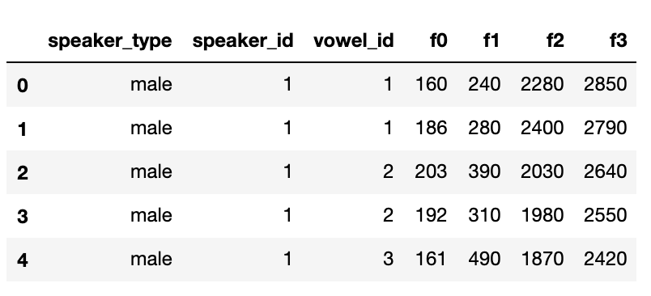
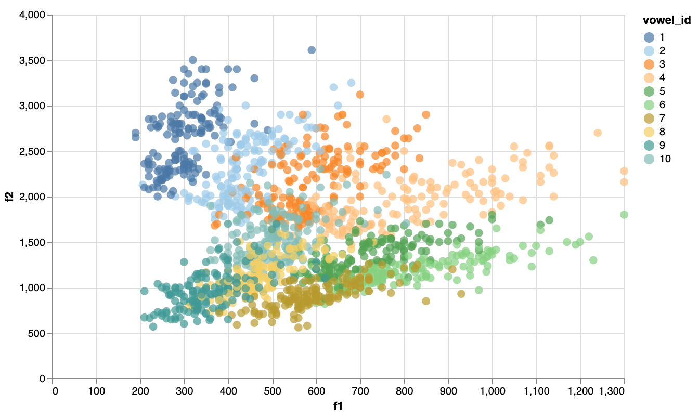
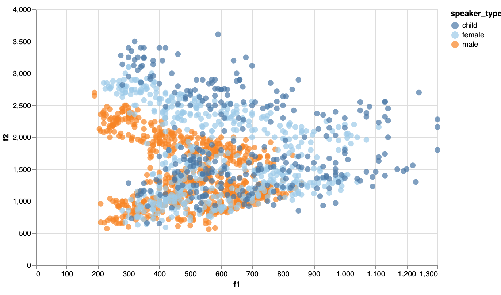
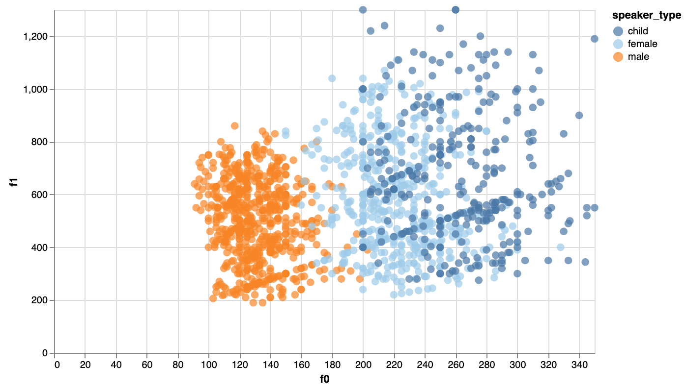
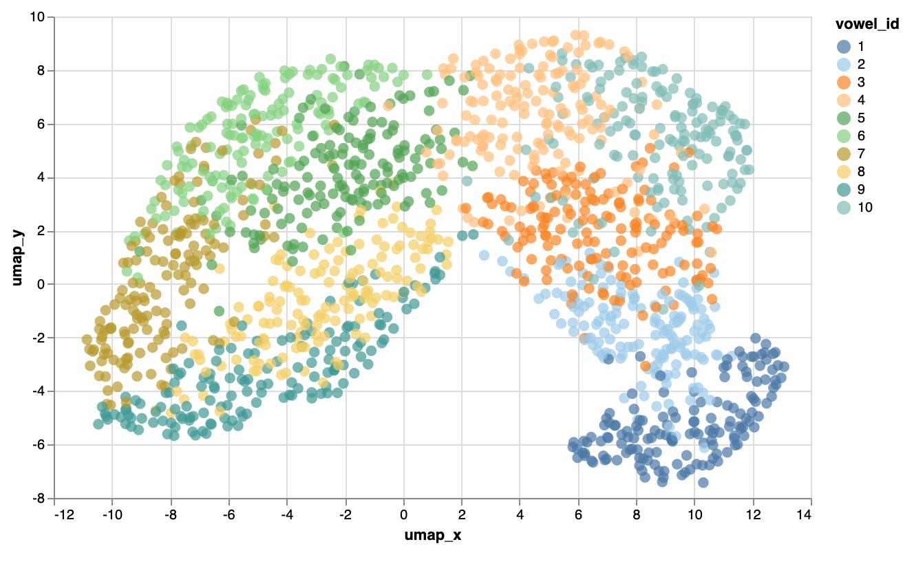

The learning of a language's phonetic inventory can be a tricky problem for children to figure out, and more so for machines.
Phonemes, which are units of sound (for example the /t/ sound at the beginning of 'tree') are identified by their 'place of articulation' and 'manner of articulation'. For more see: https://en.wikipedia.org/wiki/International_Phonetic_Alphabet_chart.
Vowels in particular can be difficult, since compared to consonants, they have less identifying features. 

The data for this project comes from a rather old paper, Peterson & Barney 1952, and consists of measurements of four acoustic features, F0, F1, F2 and F3 values, for two repetitions of 10 different vowels by 76 speakers of British English. There are 1520 data points, each containing the following features; speaker type (male,female,child), speaker number (unique id for each participant), vowel identity (true vowel category) and the aforementioned f0, f1, f2 and f3 formant values. The data looks like this:

<p align="center">
  
</p>

Our task now is to use the available features to predict the true vowel category for each data point. We impose the constraint of using unsupervised methods to achieve this to simulate the problem as it exists for children; they don't get feedback (labeled data) on whether or not they have correctly identified a vowel. In fact, a simple logistic regression model can correctly classify data points with about 70% accuracy, using just the f1 and f2 formant values:

```python
# get f1 and f2 format values:
X = []
for index, row in df.iterrows():
    X.append([row['f1'],row['f2']])
```
```python
# get true vowel ids:
y = df['vowel_id'].values
```
```python
# create 80-20 train-test split:
X_train, X_test, y_train, y_test = train_test_split(X, y, test_size=0.2, random_state=42)
```
```python
# fit model and score on test data:
clf = LogisticRegression(random_state=0).fit(X_train, y_train)
clf.score(X_test, y_test)
```
The model scores 70.0657%. Incorporating f0 and f3 formant values increases this to about 84%. 

### Unsupervised clustering:

Before we attempt to cluster these data points into our vowel categories, let's see what the data looks like in a 2d space, plotting the f1 and f2 values:

<p align="center">
  
</p>

We see that while the clusters show some separation, the overlap is certainly not trivial. We can attempt to cluster these points into out 10 vowel categories using k-means (we are making a assumption here that we know how many vowel categories there are; children figure this out by themselves): 

```python
# we reuse the 2d vectors we extracted before (X):
kmeans_2d = KMeans(n_clusters=10, random_state=0).fit(X)
kmeans_clusters_2d = kmeans_2d.labels_
```
This leads to the following results:

precision: 0.34588481999605936

recall: 0.4283112582781457

f_score: 0.3827101857763521 


Not too impressive. We do however have more features at our disposal. Let's take a look at what the space looks like when we break our data up by speaker type:

<p align="center">
  
</p>

It seems that for each speaker type we have a '>' shaped distribution. If we isolate the vowels produced by male speakers we get the following performance:

precision: 0.5255357669150773

recall: 0.5819114219114219

f_score: 0.5522886661799519

We need some way to account for the variation produced by different speaker types. The fundamental frequency (f0) is likely quite different for our speaker types. Plotting f0 by f1 we get:

<p align="center">
  
</p>

f0 is indeed quite discriminative between speaker types. The obvious thing to do would be to expand out 2d vector to 4d, including f0 and f3 formant values and clustering:

```python
for index, row in df.iterrows():
    X_4d.append([row['f0'],row['f1'],row['f2'],row['f3']])
 
kmeans_4d = KMeans(n_clusters=10, random_state=0).fit(X_4d)
```

This results in:

precision: 0.3487741383999689

recall: 0.39109445799930287

f_score: 0.3687239417527573 

Including f0 and f3 in fact worsened our performance. k-means might be struggling in the 4d space since the notion of distance gets a bit fuzzy at higher dimensions. We could try reducing our 4d vectors back to 2d using UMAP (we'll try 3d as well and see which performs better):

```python
mapping_2d = umap.UMAP(n_neighbors=100,min_dist=0.5,random_state=42,n_components=2, metric='cosine').fit_transform(X_4d) 
mapping_3d = umap.UMAP(n_neighbors=100,min_dist=0.5,random_state=42,n_components=3, metric='cosine').fit_transform(X_4d) 
```

We can now plot our vowels in our new 2d space:

<p align="center">
  
</p>

We can see that the vowels are now more separated in 2d. We will now use GMM clustering since it generalized better to more complex geometries (we use the 3d mappings since these performed better):

```python
gmm = GMM(n_components=10, covariance_type='full').fit(mapping_3d)
gmm_clusters = gmm.predict(mapping_3d)
df['gmm_clusters'] = gmm_clusters
get_performance(df,'gmm_clusters')
```

We get these results:

precision: 0.5044320075052974

recall: 0.5434907633321715

f_score: 0.5232334756675588

While these might still seem a bit underwhelming, we've come pretty close to matching the performance on a single speaker type, meaning that we have accounted for most of the variation introduced by speaker_types. It is also important to keep in mind the difficulty of this task. Children likely get a lot more than ~1500 vowel inputs per day and therefore have access to an exponentially larger amount of data. One avenue for further work might be to use a density based clustering algorithm to find centers of high density and use these as seeds for further clustering. 


